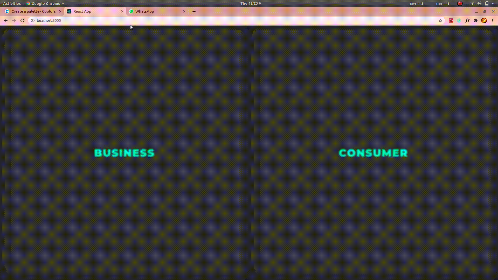

<p align="center">
  <a href=""></a> 
</p>

<p align="center">
  <h1>EverPro</h1>
  <h4>A fast, robust product intelligence api for bussiness devolepment.</h4>
</p>

EverPro is Web-Application cum collection of product intelligence APIs that help businesses identify the performance not only for their products but a way to track other businesses' products in an e-market.

## Quick Links

- [Install](#install)
- [Quick Start](#quick-start)
- [API Documentation](#api-documentation)
- [API Clients](#api-clients)
- [Testing](#testing)
- [Support](#support)
- [OUR TEAM](#our-team)

## Install

Clone the repository `git clone https://github.com/naklic0der/EVERPRO.git`.

### Frontend

Run `cd frontend/everpro` ,
1. **Install the dependencies:** Run command `npm install` [ONE TIME]
2. **Build Development Files:** Run command `npm run build`
3. **Start Development Server:** Run command `npm start`

This should automatically open in browser, if not\
Open [http://localhost:3000](http://localhost:3000) to view it in the browser.

The page will reload if you make edits.\
You will also see any lint errors in the console.

**NOTE:**
1. To download new dependencies: `npm install --save <DEPENDENCY_NAME>`
2. While contributing, **DO NOT PUSH YOUR BUILD OR NODE MODULES FOLDER**

### Backend

Run `cd backend/everpro` ,
**NOTE:** First start a virtual environment
**Install the dependencies:** Run command `pip install -r requirements.txt`

Open [http://localhost:8000](http://localhost:8000) to view it in the browser.

The page will reload if you make edits and **save**.\
You will also see any lint errors in the console.

#### Using React UI in django

Every time you make changes in React code, make sure you run `npm run build` to update the build folder,\
which is set as the default React UI path in Django settings.
**NOTE:** It correctly bundles React in production mode and optimizes the build for the best performance.

####  Frontend-Tests

`npm test` Launches the test runner in the interactive watch mode.
See the section about [running tests](https://facebook.github.io/create-react-app/docs/running-tests) for more information.

 ## Quick Start
 
Go to `backend/everpro`
 
Initiate the Django server

```bash
django r
```

You need 1 in-memory-database and 2 celery servers to run this app:

```bash
redis-server
```

```bash
celery -A everpro worker -l info
```

```bash
celery -A everpro beat -l info
```

<br/>
<br/>
<br/>
<br/>
 
## API Documentation
 
The complete [Swagger documentation](https://app.swaggerhub.com/apis/SOAD_Group_21/PI_EM_API/1.0.2) of our API is given here.


### 1. Inventory Scrapping (INV-SCR)

The objective of this service is to monitor the inventory for a product in real-time. Any change detected is added to our dataframe.

#### Technologies 

- [Django REST framework](https://www.django-rest-framework.org/) is a powerful and flexible toolkit for building Web APIs.
- [Selenium](https://www.selenium.dev/documentation/en/) is an umbrella project for a range of tools and libraries that enable and support the automation of web browsers. We used it to create a `BROWSER_AGENT` that scrapes information from e-markets sites periodically and manages its own database, later on, the worker agent ([celery](https://docs.celeryproject.org/en/stable/)) updates the API database.

#### Endpoints Structure for INV-SCR API

In a RESTful API, endpoints (URLs) define the structure of the API and how end users access data from our application using the HTTP methods (GET, POST, PUT, DELETE), making all possible CRUD (create, retrieve, update, delete) operations.
    
    http://127.0.0.1:8000/api/productdata/

Endpoint |HTTP Method | CRUD Method | Result
-- | -- |-- |--
`api/api-token-auth/` | POST | CRAETE | Create credentials for a business account
`api/productdata/` | GET | READ | Get all the `ProductData` record
`api/productdata/`| POST | CREATE | Create a new `ProductData` record
`api/productdata/<asin:str>` | GET | READ | Get a single `ProductData` record
`api/productdata/<asin:str>` | PUT | UPDATE | Update a `ProductData` record
`api/productdata/<asin:str>` | DELETE | DELETE | Delete a `ProductData` record

#### Example

```python

# Login/Signup to EverPro to get your key

headers = {
    "Content-Type": "application/json"
}

data = {
    "asin": "B084CQSL3Q",
    "platform": "Amazon",
    "zone": "US",
    "stock_info": null,
    "all_other_details": null,
    "product_name": null,
}

response = requests.post(
    "http://127.0.0.1:8000/api/productdata/", 
    headers=headers, 
    data=json.dumps(data)
)
```

**Note:**
Details will be updated once the celery worker is done scrapping this `asin`, which might take around 5-10 minutes based on the total data size.

And 

`response` will be like:

```json
{
    "asin": "B084CQSL3Q",
    "platform": "Amazon",
    "zone": "US",
    "stock_info": "in stock on january 22 2021 order it now",
    "all_other_details": "Other details not available",
    "product_name": "Fitbit Charge 4 Fitness and Activity Tracker with Built-in GPS, Heart Rate, Sleep & SwimTracking, Rosewood/Rosewood, One Size (S &L Bands Included)",
    "last_updated": "2020-12-12T10:34:47.020000Z"
}
```

<br/>
<br/>
<br/>

### 2. Competition Tracking (CMP-TRACK)

The objective of this service is track similar products.
- [x] Constant monitoring of similar product URL instances.

#### Technologies 

- [Django REST framework](https://www.django-rest-framework.org/) is a powerful and flexible toolkit for building Web APIs.
- [Selenium](https://www.selenium.dev/documentation/en/) is an umbrella project for a range of tools and libraries that enable and support the automation of web browsers. We used it to create a `BROWSER_AGENT` that scrapes information from e-markets sites periodically and manages its own database, later on, the worker agent ([celery](https://docs.celeryproject.org/en/stable/)) updates the API database.

#### Endpoints Structure for INV-SCR API

In a RESTful API, endpoints (URLs) define the structure of the API and how end users access data from our application using the HTTP methods (GET, POST, PUT, DELETE), making all possible CRUD (create, retrieve, update, delete) operations.
    
    http://127.0.0.1:8000/api/competition_tracking/

Endpoint |HTTP Method | CRUD Method | Result
-- | -- |-- |--
`api/api-token-auth/` | POST | CRAETE | Create credentials for a business account
`api/competition_tracking/` | GET | READ | Get all the `Competition Track` record
`api/competition_tracking/`| POST | CREATE | Create a/multiple new `Competition Track` record
`api/competition_tracking/<asin:str>` | GET | READ | Get a single `Competition Track` record
`api/competition_tracking/<asin:str>` | PUT | UPDATE | Update a `Competition Track` record
`api/competition_tracking/<asin:str>` | DELETE | DELETE | Delete a `Competition Track` record

#### Example

```python

# Login/Signup to EverPro to get your key

headers = {
    "Content-Type": "application/json",
}

data = {
    "asin": "B085J1D8BH", 
    "zone": "IN",
}

response = requests.post(
    "http://127.0.0.1:8000/api/competition_tracking/", 
    headers=headers, 
    data=json.dumps(data)
)
```

**Note:**
Details will be updated once the celery worker is done scrapping this `asin`, which might take around 1-2 hours based on the total data size.

And,

`response` will be like:

```json
{
   "tracker_firm":"OMNIKART",
   "tracking":[
      {
         "asin":"B081QXQVFM",
         "linkToProduct":"https://www.amazon.in/gp/slredirect/picassoRedirect.html/ref=sspa_dk_detail_0?ie=UTF8&adId=A0667412129W9UE1L5QRV&qualifier=1607769256&id=7789242783212545&widgetName=sp_detail&url=%2Fdp%2FB081QXQVFM%2Fref%3Dsspa_dk_detail_0%3Fpsc%3D1%26pd_rd_i%3DB081QXQVFM%26pd_rd_w%3Dn6X4J%26pf_rd_p%3D1801b34c-8af9-42b5-8961-11f124edc99b%26pd_rd_wg%3DqM7gU%26pf_rd_r%3DRTK7GKMYTKJ2B3KRXY33%26pd_rd_r%3D2e89109e-08b2-4406-b9e0-7ae95ccaf382",
         "details":{
            "product_title":"pTron Bassbuds Lite V2 In-Ear True Wireless Bluetooth 5.0 Headphones with HiFi Deep Bass, Total 20Hrs Playtime, Ergonomic Sweatproof Earbuds, Noise Isolation, Voice Assistance & Built-in Mic - (Black)",
            "seller":"M/S LOTUS MOBILE POINT",
            "stock_info":"deal is 30 claimed in stock",
            "stars":"a-star-3-5",
            "reviews":"10,467",
            "price":"₹ 899.00"
         }
      },
      {
         "asin":"B08D755ML6",
         "linkToProduct":"https://www.amazon.in/gp/slredirect/picassoRedirect.html/ref=sspa_dk_detail_5?ie=UTF8&adId=A00203782UGDIB6FHR0OK&qualifier=1607769256&id=7789242783212545&widgetName=sp_detail&url=%2Fdp%2FB08D755ML6%2Fref%3Dsspa_dk_detail_5%3Fpsc%3D1%26pd_rd_i%3DB08D755ML6%26pd_rd_w%3Dn6X4J%26pf_rd_p%3D1801b34c-8af9-42b5-8961-11f124edc99b%26pd_rd_wg%3DqM7gU%26pf_rd_r%3DRTK7GKMYTKJ2B3KRXY33%26pd_rd_r%3D2e89109e-08b2-4406-b9e0-7ae95ccaf382",
         "details":{
            "product_title":"pTron Bassbuds Urban in-Ear True Wireless Bluetooth 5.0 Headphones with Deep Bass, Touch Control Earbuds, IPX4 Water & Sweat Resistance, Noise Isolation, Voice Assistance & Built-in Mic - (Black)",
            "seller":"Visit the PTron Store",
            "stock_info":"deal is 8 claimed in stock",
            "stars":"a-star-3-5",
            "reviews":"3,271",
            "price":"₹ 1,499.00"
         }
      }
   ]
}
```

<br/>
<br/>
<br/>

### 3. Shop Positioning System (SPS)

This API helps to analyze distribution of shops(**range: 5 Km**).


#### Technologies
- [Django REST framework](https://www.django-rest-framework.org/) is a powerful and flexible toolkit for building Web APIs.

- [PostgreSQL](https://www.postgresql.org/) is the World's Most Advanced Open Source Relational Database.

- [PostGIS](http://postgis.net/) is a spatial database extender for PostgreSQL object-relational database. It adds support for geographic objects allowing location queries to be run in SQL.

- [Geopy](https://geopy.readthedocs.io/en/stable/) is a Python client for several popular geocoding web services.

- [Amazon S3](https://aws.amazon.com/s3/): Amazon Simple Storage Service (Amazon S3) is an object storage service that offers industry-leading scalability, data availability, security, and performance. 

#### Requirements
- Ubuntu 18

#### Installation

```Makefile``` will help you with all the installation. First of all, in ```django-google-maps/core/``` path, execute:

    make setup

This will install PostgreSQL, PostGIS and pip on your system. After that, you need to create and fill up **settings.ini** file, with the structure as below:

    [postgresdbConf]
    DB_ENGINE=django.contrib.gis.db.backends.postgis
    DB_NAME=dbname
    DB_USER=user
    DB_PASS=password
    DB_HOST=host
    DB_PORT=port

    [GEOSGeometryConf]
    max_distance=5

    [googleMapsConf]
     API_KEY=yourGoogleAPIKey
    defaultLat=<Your_default_latitude>
     defaultLng=<Your_default_lingitude>

    [amazonS3Conf]
    S3_ACCESS_KEY=<Your_access_key>
    S3_SECRET_KEY=<Your_secret_key>
    s3_bucket_name=<Your_bucket_name>

    [font-awesomeConf]
    KEY=<Your_key>

- postgresdbConf section: fill in with your own PostgreSQL credentials. By default, DB_HOST and DB_PORT in PostgreSQL are localhost/5432. 

- GEOSGeometryConf section: a ```max_distance``` suggested could be from 1-5 kilometers, to display nearby places. 

- googleMapsConf section: google maps API KEY needed to load the map, also default lat and longitude to focus your map

- font-awesomeConf section: optional, if you have a Font Awesome key for icons

Then, activate your virtualenv already installed (by default, is called ```env``` in the ```Makefile```):

    source env/bin/activate

And execute:

    make install

This will generate the database with default data and also it will install python requirements and nltk resources. Default credentials for admin superuser are: admin@admin.com / admin. 

Run django server (by default, host and port are set as 127.0.0.1 and 8000 respectively in the ```Makefile```):

    make execute

You could see the home page in:

    http://127.0.0.1:8000/index/

The map will be set in the ```defaultLat``` and ```defaultLng``` position.

#### Models

- Spots: table to store places of the users. This table contains a position (PostGIS geometry) column that works to store information of latitude and longitude in WGS 84 format.
- Tags: table to store tags related to the spots

#### Endpoints Structure for Spots API
In a RESTful API, endpoints (URLs) define the structure of the API and how end users access data from our application using the HTTP methods (GET, POST, PUT, DELETE), making all possible CRUD (create, retrieve, update, delete) operations.
    
    http://127.0.0.1:8000/api/spots/

Endpoint |HTTP Method | CRUD Method | Result
-- | -- |-- |--
`api/<instance>` | GET | READ | Get all the <instance> record
`api/<instance>/:id` | GET | READ | Get a single <instance> record
`api/<instance>`| POST | CREATE | Create a new <instance> record
`api/<instance>/:id` | PUT | UPDATE | Update a <instance> record
`api/<instance>/:id` | DELETE | DELETE | Delete a <instance> record

#### Aditional Endpoints related to possible actions

**Add a custom place (CREATE)**

* Endpoint path: `api/spots/create_spot/`

In "GoogleMaps" tab, you can create a new spot doing click in a position of the map and then doing click on the "Add Place" button: , fill-up the form and save your spot. Also, you can create several lists of tags for your place.


Note: We used [tagEditor](https://goodies.pixabay.com/jquery/tag-editor/demo.html) plugin to create and edit tags, unfortunately, this project is death but was the most recent jQuery tag editor that we could found.

**See spots details (READ)**

* Endpoint path: `api/spots/user_places/`

In "My Spot List" tab, you can see all the details of your spot list. 

**Spot details (RETRIEVE)**

* Endpoint path: `api/spots/spot_details/`

In "My Spot List" tab, you can click on any spot and see the information related to it.

**Edit spots (UPDATE)**

* Endpoint path: `api/spots/edit_spot/`

In "My Spot List" tab, you can edit spots by changing the name or tags related to it.

**Remove a place (DELETE)**

* Endpoint path: `api/spots/delete_spot/`

In "My Spot List" tab, you can delete a spot in the garbage icon. This action will delete the tags related to the spot if those tags don't exist for any other spot.

**Nearby places**

* Endpoint path: `api/spots/nearby_places/`

In "GoogleMaps" tab, you can display nearby places from your current position within 'max_distance' in the nearby button: . The map will show your nearby places with the icon below: 

<br/>
<br/>
<br/>


### 4. Search Engine Optimisation (SE-OPT)

The objective of this service is to make existing business websites subscriptable by search engines, or to scale their business idea.

#### Technologies 

- [Django REST framework](https://www.django-rest-framework.org/) is a powerful and flexible toolkit for building Web APIs.

#### Endpoints Structure for INV-SCR API

In a RESTful API, endpoints (URLs) define the structure of the API and how end users access data from our application using the HTTP methods (GET, POST, PUT, DELETE), making all possible CRUD (create, retrieve, update, delete) operations.
    
    http://127.0.0.1:8000/api/shortened-urls/

Endpoint |HTTP Method | CRUD Method | Result
-- | -- |-- |--
`api/shortened-urls/<url:str>` | GET | READ | Get the `URLListView` record to-be redirected
`api/shortened-urls/`| POST | CREATE | Create a new `URLListView` record

<br/>
<br/>
<br/>

## Testing

We have done testing using [coverage](https://django-testing-docs.readthedocs.io/en/latest/coverage.html).

Code coverage describes how much source code has been tested. It shows which parts of your code are being exercised by tests and which are not. It’s an important part of testing applications, so it’s strongly recommended to check the coverage of your tests.

```bash
coverage run --source='.' manage.py test
```

This runs your tests and collects coverage data of the executed files in your project. You can see a report of this data by typing following command:

```bash
coverage report
```

For more options like annotated HTML listings detailing missed lines, see the coverage.py docs.

<br/>

## API Clients

**Market Analysis Potential Customers** for our API vary from business startups to large business houses (product development) to intelligize their product *development/monitoring* process.

<br/>

## Support

You can contribute to this project if you want to.
Make a Pull Request about it and we'll get back to you.

<br/>

## OUR TEAM


